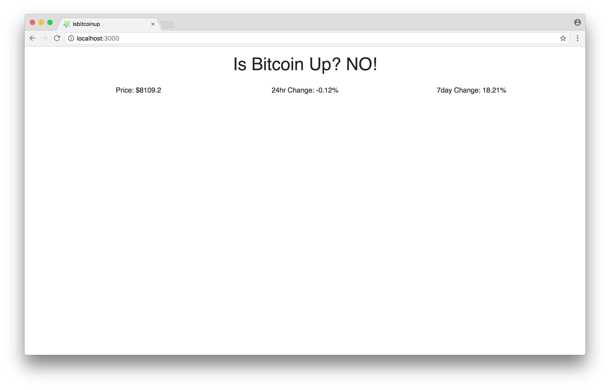

## What is this?
**isbitcoinup** is a simple rails application that showcase how to use Docker in
a development environment. It is consist of several services including postgres,
sidekiq and redis. It's a good example on how to connect multiple services via
`docker-compose`.

## How to run it?
  1. Install Docker for your OS first. [Click here](https://docs.docker.com/install/) for specific instructions.
  2. Clone the repo
  3. Run `docker-compose run --rm web rails rails db:create db:migrate` for
     setting up the database
  4. Run `docker-compose up` to run the whole app.

## How to develop with Docker?
  - If you're gonna run commands like `rails g migration CreateTable`. You
    need to prefix it with `docker-compose run --rm web`. web is our service
    for our rails app. So the final command will be `docker-compose run --rm
    web rails g migration CreateTable`.

